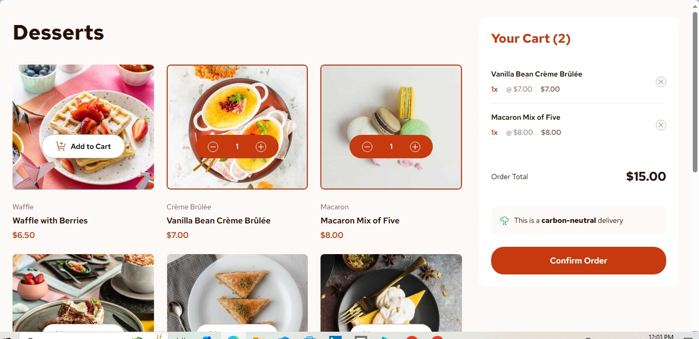

# Frontend Mentor - Product list with cart solution

This is my solution to the [Product list with cart challenge on Frontend Mentor](https://www.frontendmentor.io/challenges/product-list-with-cart-5MmqLVAp_d). Frontend Mentor challenges help you improve your coding skills by building realistic projects. 

## Table of contents

- [Overview](#overview)
  - [The challenge](#the-challenge)
  - [Screenshot](#screenshot)
  - [Links](#links)
  - [Built with](#built-with)
  - [Useful resources](#useful-resources)
- [Author](#author)

## Overview

### The challenge

Users should be able to:

- Add items to the cart and remove them
- Increase/decrease the number of items in the cart
- See an order confirmation modal when they click "Confirm Order"
- Reset their selections when they click "Start New Order"
- View the optimal layout for the interface depending on their device's screen size
- See hover and focus states for all interactive elements on the page

### Screenshot

### Links

- Solution URL: [Product List With Cart](https://github.com/QMS85/ProductListWithCart.git)
- Live Site URL: [Product List With Cart](https://qms85.github.io/ProductListWithCart/)

### Built with

- Semantic HTML5 markup
- CSS custom properties
- Flexbox
- CSS Grid
- Mobile-first workflow

If you want more help with writing markdown, we'd recommend checking out [The Markdown Guide](https://www.markdownguide.org/) to learn more.

### Useful resources

- [w3 Schools](https://www.w3schools.com) - Learn To Code
- [freeCodeCamp: Responsive Web Design](https://www.freecodecamp.org/learn/2022/responsive-web-design/) - Learn Responsive Web Design

## Author

- My Portfolio Website - [Jonathan Peters](https://qms85.github.io/MyPortfolio/)
- Frontend Mentor - [@yourusername](https://www.frontendmentor.io/profile/QMS85)
- Facebook - [Jonathan Peters](https://www.facebook.com/2jonathanpeters)
- Twitter - [@DJJonnas85](https://www.twitter.com/DJJonnas85)
- Linkedin - [Jonathan Peters](https://www.linkedin.com/in/2jonathanpeters)

